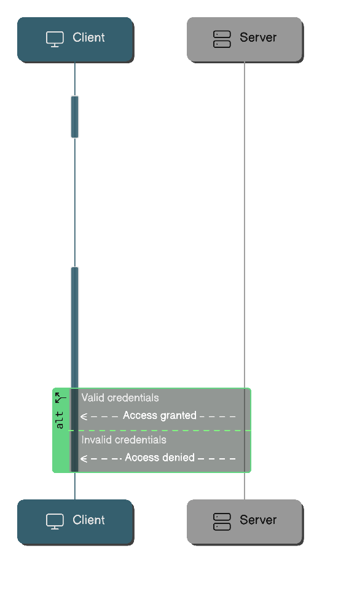

# Authentication Schemes

Here I would like to implement as many authentication schemes as possible

## Basic Authentication

### Introduction

Basic authentication is one of the simplest and oldest HTTP authentication schemes. It provides a method for client to send credentials (username & password) to servers while making HTTP requests.

### How Basic Authentication Works

- Client makes a request to a protected resource.
- Server responds with 401 Unauthorized status and `WWW-Authenticate: Basic` header.
- Client encodes credentials
    - Credentials are concatenated with a colon seperator (`username:password`).
    - The resultant string will be encoded using Base64.
- Client retries the request with `Authorization: Basic <Base64 encoded credentials>` header.
- Server validates credentials and grant/denies access.

### Security Considerations

- Always use HTTPS (secure)
    - Basic Auth sends credentials in easily decodable Base64
    - Without TLS, credentials are vulnerable to interception

### Limitations

- No built-in mechanism for session management
- Credentials need to be sent with every request
    - Increases exposure to man-in-the-middle attacks
- It will be good to implement Rate Limiting & log authentication attempts.
- Hard to implement features like MFA & Role based access control.
- Despite simple to implement, it is not recommended to use in production environments
